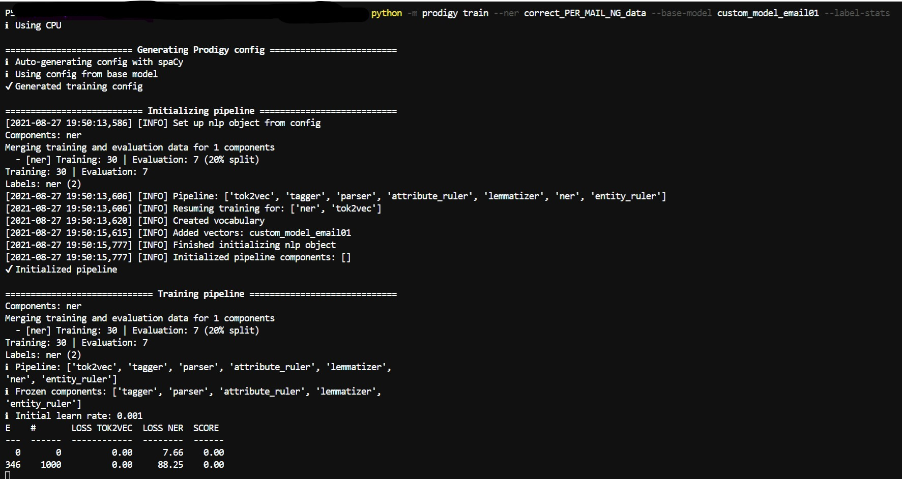

# The Case for Custom AI: Beyond Out-of-the-Box Solutions

In the current AI gold rush, large language models and pretrained solutions promise unprecedented capabilities across a vast spectrum of applications. Their generalist nature and impressive demonstrations make them appear as universal problem-solvers. However, beneath this appealing facade lies a more nuanced reality: these models, despite their broad capabilities, often fall short when confronted with specialized business challenges that require deep domain expertise and precise, reliable outputs.

The challenge extends beyond mere technical limitations. Large language models, trained on general-purpose data and optimized for broad applicability, have developed an concerning characteristic: they tend to project confidence even in situations of uncertainty. This behavior mirrors a problematic aspect of our corporate culture, where the pressure to appear knowledgeable and capable can overshadow the valuable practice of acknowledging limitations and embracing learning opportunities. Just as workplace culture often rewards apparent success over honest acknowledgment of growth areas, these models are inherently biased toward providing plausible-sounding answers rather than admitting uncertainty.

This predisposition becomes particularly problematic in specialized business contexts, where accuracy and reliability are paramount. While these models excel at general tasks, their tendency to provide confident yet potentially inaccurate responses in specialized domains can lead to costly mistakes and misguided decisions. The real strength of AI in business contexts often lies not in knowing all answers, but in knowing when to express uncertainty and identify opportunities for learning and improvement.

In this landscape, businesses face a critical decision: whether to rely on pre-built, out-of-the-box AI models or invest in developing custom solutions. While the allure of ready-made solutions is strong, there's a compelling case for organizations to consider building their own AI models, particularly in regulated industries or when specific performance requirements must be met. This approach allows organizations to create systems that not only solve specific problems but do so with appropriate levels of confidence and transparency.

## The Hidden Costs of Generic Solutions

The initial appeal of pre-built AI models often lies in their immediate availability and apparent cost-effectiveness. However, this surface-level economy can mask significant long-term expenses. As usage scales, the pay-per-call pricing model of many AI services can lead to unpredictable and often excessive costs. Organizations frequently find themselves locked into expensive service agreements, with costs that grow proportionally—or even exponentially—with their usage.

## Quality Control and Performance Optimization

Custom AI models offer unprecedented control over model behavior and output quality. Unlike generic solutions, which must cater to a broad range of use cases, custom models can be specifically optimized for domain-specific vocabulary and terminology, industry-specific accuracy requirements, specialized data formats and structures, unique business logic and constraints, and performance requirements in specific scenarios.

## The Power of Fine-tuning and Iteration

One of the most significant advantages of custom AI development lies in the ability to continuously refine and improve the model based on actual usage patterns and feedback. This iterative process allows organizations to address specific edge cases relevant to their domain, optimize model size and computational requirements, enhance accuracy for critical use cases, eliminate unnecessary features that consume resources, and adapt to changing business needs and requirements.

## Compliance and Data Security

For organizations operating in regulated industries, custom AI development isn't just an option—it's often a necessity. Self-hosted custom models provide complete control over data handling and processing, compliance with specific regulatory requirements, audit trails for model decisions and updates, data sovereignty and localization capabilities, and enhanced security through controlled deployment environments.

> The cost of non-compliance far exceeds the investment required for custom AI development.
> A lesson learned from regulated industries

## Model Compression and Efficiency

Custom development allows organizations to implement sophisticated model compression techniques that can dramatically reduce operational costs while maintaining performance. Through knowledge distillation, organizations can create smaller, faster models that retain the essential capabilities of larger models while requiring fewer computational resources.

## The Economics of Scale

While the initial investment in custom AI development may be higher, the long-term economics often favor this approach, particularly at scale. Organizations can eliminate per-call API costs, optimize infrastructure utilization, reduce bandwidth costs through efficient model design, control computational resources directly, and avoid vendor lock-in and associated costs.

## The Foundation of Success: Quality Data and Transparent Limitations

The effectiveness of any AI model is intrinsically tied to the quality of its training data. Custom AI development enables organizations to maintain complete control over their training datasets, ensuring they accurately represent the specific use cases and scenarios relevant to their operations. This control extends beyond mere data collection to encompass the entire data lifecycle, including validation, cleaning, and continuous updates.

More importantly, custom models can be designed to prioritize transparency over false confidence. Unlike many out-of-the-box solutions that might generate plausible-sounding but incorrect responses, a well-designed custom model can be engineered to explicitly acknowledge its limitations and uncertainties. This honest approach to model limitations serves multiple crucial purposes: it helps identify areas for improvement, guides future training efforts, and builds trust with end-users who can rely on the model to be forthright about its capabilities.

> A model that knows what it doesn't know is more valuable than one that pretends to know everything.
> The cornerstone of responsible AI development

This transparency-first approach creates a virtuous cycle of improvement. When a model gracefully handles edge cases by acknowledging uncertainty, organizations can systematically identify gaps in their training data or model capabilities. These insights drive targeted data collection efforts, inform fine-tuning strategies, and guide the evolution of the model's architecture. The result is a continuously improving system that grows more capable while maintaining its integrity and trustworthiness.

## The Path Forward

The decision to develop custom AI models represents a strategic investment in technological sovereignty and operational excellence. While it requires greater initial effort and expertise, the benefits of control, cost optimization, and compliance often make it the superior choice for organizations with specific requirements or scale considerations. By taking control of their AI infrastructure through custom development, organizations can build a more sustainable, efficient, and compliant foundation for their AI initiatives.
