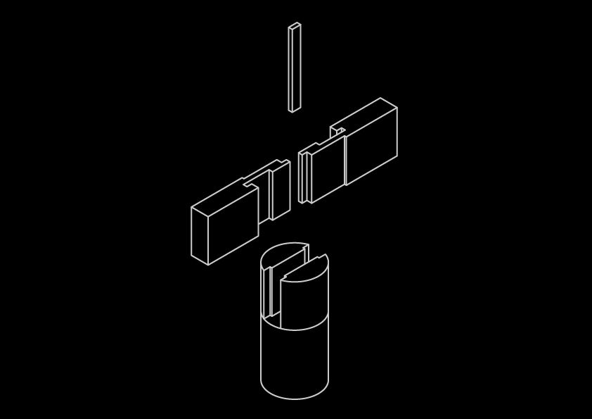
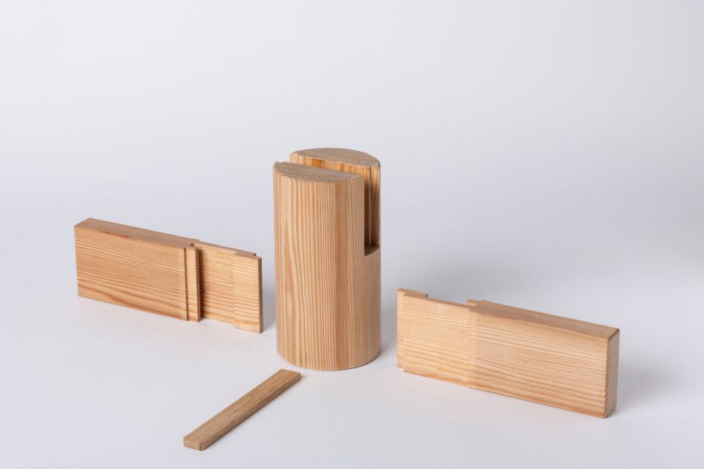
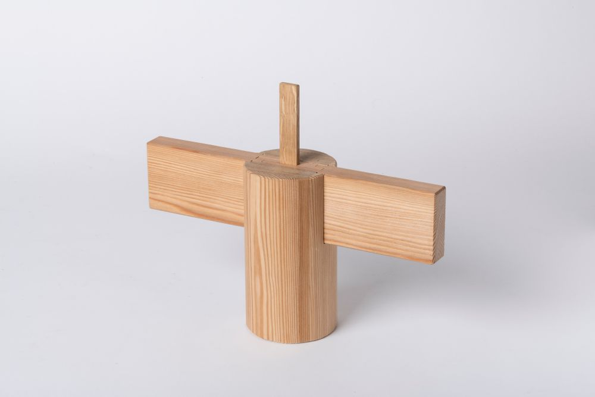
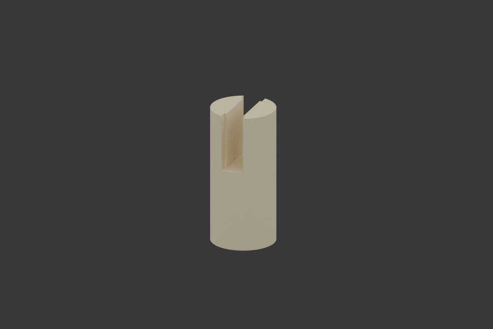

# Daimochi Tsugi

The ==Daimochi Tsugi== stands as one of the most robust joints in Japanese woodworking, its name literally translating to "large holding joint." This powerful connection method has been used for centuries in the construction of large-scale wooden structures, particularly in areas requiring exceptional strength and ~~structural integrity~~.

## Understanding Daimochi Tsugi

At its core, the Daimochi Tsugi is designed to handle substantial loads while maintaining the elegant aesthetics characteristic of Japanese joinery. This joint is particularly notable for its ability to resist both compression and tension forces.

The Daimochi Tsugi achieves its remarkable strength through a sophisticated combination of interlocking components. Each element of the joint is ==carefully proportioned== to ensure optimal load distribution and long-term stability.

## Technical Composition

The joint's complexity lies in its precise geometric relationships. Each cut must be executed with extreme accuracy to ensure the joint functions as intended.

> The Daimochi Tsugi represents the perfect balance between engineering principles and artistic craftsmanship.

### Structural Elements

The joint comprises several key features:

1. Primary mortise pocket
2. Supporting tenons
3. Wedge-based locking mechanism
4. Stress distribution channels

## Historical Development

The development of the Daimochi Tsugi reflects the evolution of Japanese architectural needs. Originally conceived for temple and castle construction, it has adapted to serve in various contexts while maintaining its core principles.

### Traditional Applications

Historically, the joint was essential in:
- Temple beam connections[^1]
- Castle foundation supports
- Bridge construction
- Heavy timber framing

## Modern Implementation

Contemporary architects and woodworkers continue to find new applications for this ancient joint, particularly in projects[^2] requiring both strength and aesthetic appeal.

The ==enduring relevance== of the Daimochi Tsugi speaks to its excellent design and the timeless principles it embodies. In an age of modern materials and techniques, this joint continues to prove its worth in both traditional and contemporary contexts.

### Contemporary Uses

Modern applications include:
- Eco-friendly building projects
- Large-scale timber constructions
- Artistic architectural elements
- Sustainable design solutions

    [^1]: Named footnotes will still render with numbers instead of the text but allow easier identification and linking.  

    [^2]: This footnote also has been made with a different syntax using 4 spaces for new lines.