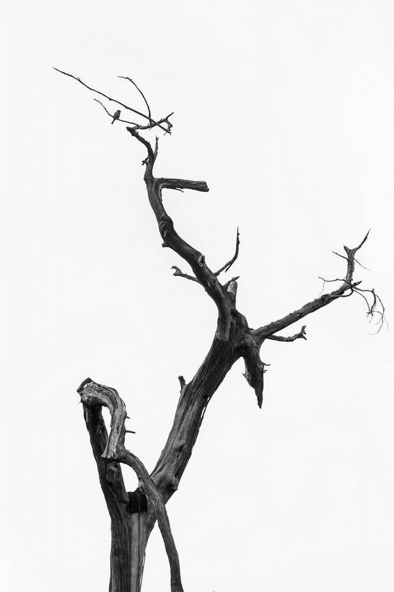

# Slow Design

In the relentless pursuit of innovation and growth, modern businesses often find themselves caught in a perpetual cycle of change and adaptation. The pressure to continuously disrupt, iterate and transform can feel all-consuming, leaving little room for pause or reflection. This frantic tempo can lead to hasty decisions, unforeseen errors and even unprecedented negative ripple effects that undermine long-term sustainability.

## The Ancient Wisdom of the 道 (Dao)

Yet, as I explored in my previous article, the ancient Taoist concept of 变化 (bianhua) - constant flux and transformation - offers valuable insights for navigating this demanding landscape. By embracing change and cultivating agility, companies can thrive in the face of rapid evolution.

However, the 道 (Dao) also teaches us that some things are best allowed to unfold at their own natural pace. The Taoist sages recognized that forceful, aggressive action is not always the wisest path. Sometimes, the most impactful change emerges slowly, organically, in its own time.

## Contrasting Rhythms: The 道 (Dao)'s Slow Cadence vs. Business AccelerationS

This underlying rhythm of the 道 (Dao) stands in stark contrast to the frenetic tempo of modern business. In our quest for ever-faster innovation cycles, we can easily lose sight of the value of patient, gradual development. The pressure to deliver quarterly results and stay ahead of competitors can blind us to the virtues of letting things blossom at their own cadence.

## The Power of Unhurried Transformation

Consider, for instance, the example of a sapling slowly growing into a towering oak tree. This process unfolds over decades, defying the impatient timelines that drive so much of our commercial activity. Yet, the oak's majestic strength and longevity are a testament to the quiet power of unhurried transformation.

Similarly, in the realm of product design and development, some of the most enduring innovations have emerged through an unhurried, iterative process. The original iPhone, for example, was the result of years of gradual refinement - not a single, revolutionary breakthrough. By allowing ideas to mature organically, companies can create offerings that truly resonate with users in a deep and lasting way.

## The Principle of Wuwei (無為)

> 道 不 爲, 而 無 不 爲.
> Dào bù wéi, ér wú bù wéi

This speaks to the principle of wuwei (無為) - effortless non-action or non-doing. The idea behind wuwei is that by aligning oneself with the natural flow and patterns of the universe, one can achieve desired outcomes without needing to force or strain. It's about cultivating a state of serene, effortless presence and responsiveness, rather than relying on aggressive, willful action.

This profound Taoist quote emphasizes this core tenet of Taoist philosophy. It suggests that true transformation and change can occur without the need for overt, forceful intervention. When we learn to harmonize with the underlying currents of reality, rather than trying to rigidly control outcomes, things have a way of happening spontaneously, without undue effort.

## Finding the Right Balance

While the business world may relentlessly demand faster, bolder moves, the 道 (Dao) reminds us of the value of tranquil, gradual unfolding. By finding the right balance between adaptation and serenity, we can harness the best of both worlds - the nimble responsiveness required to thrive in today's dynamic markets, coupled with the deep, lasting impact that emerges when we learn to let things unfold in their own time.