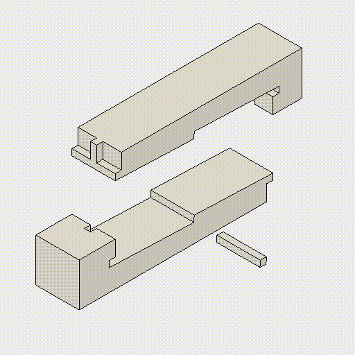

# Hako Kakushi Tsugi

The ==Hako Kakushi Tsugi== is a sophisticated hidden joint in Japanese woodworking, literally meaning "hidden box joint." This ingenious joinery method represents the pinnacle of Japanese carpentry, where the joint's complexity is concealed within the wood, leaving a clean, seamless exterior appearance. This article explores the intricacies of this ~~secret technique~~ and its applications in both traditional and contemporary woodworking.

## The Art of Concealment

The essence of Hako Kakushi Tsugi lies in its ability to create strong connections while maintaining aesthetic purity. Unlike many traditional joints that showcase their complexity, this joint embodies the Japanese principle of hidden beauty.

When observing a completed Hako Kakushi joint, one would hardly suspect the intricate puzzle of interlocking pieces hidden beneath the surface. It is a ==testament to the Japanese philosophy== of finding beauty in subtlety and restraint. The joint's strength comes from its internal structure, which distributes forces evenly across multiple contact points.

## Technical Aspects

The creation of a Hako Kakushi Tsugi requires precise calculation and execution. The joint consists of multiple components that must fit together perfectly to achieve both structural integrity and invisible assembly.

> The precision required for this joint makes it one of the most challenging to master in the Japanese woodworking tradition.

### Key Components

The joint consists of several critical elements:

1. The outer housing that conceals the joint
2. Internal locking mechanisms
3. Pressure-fit components that ensure stability

## Applications and Modern Use

Today, Hako Kakushi Tsugi finds applications in both traditional architecture and contemporary furniture design. Its ability to create clean, uninterrupted lines makes it particularly valuable in modern minimalist designs.

### Traditional Settings

In traditional Japanese architecture, the joint is commonly used in:
- Beam connections in temples
- Structural supports in tea houses
- High-end residential construction

### Contemporary Adaptations

Modern woodworkers have adapted the technique for:
- Custom furniture pieces
- Architectural details
- Art installations

## The Learning Process

Mastering the Hako Kakushi Tsugi requires dedication and patient practice. The complexity of the joint demands a deep understanding of wood properties and precise cutting techniques.

The traditional apprenticeship model typically introduces this joint only after a student has mastered more basic techniques. ==The teaching process itself== is considered an art form, with masters carefully guiding students through progressively more challenging aspects of the joint's creation.
