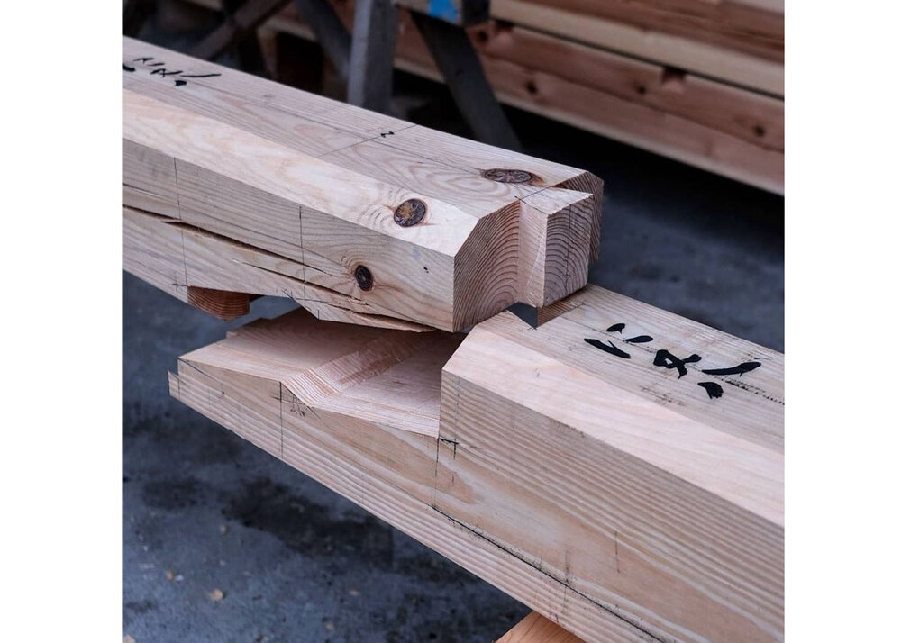

# Joinery in design

Kanawa-tsugi is a traditional Japanese woodworking technique that has been practiced for centuries. It is a form of joinery that involves connecting two pieces of wood together using precise cuts and interlocking joints. This article will delve into the art of ==Kanawa-tsugi==, exploring its history, cultural significance, technical aspects, aesthetics, learning process, and its future in both traditional and ~~modern applications~~.

## Understanding the Art of Kanawa-tsugi

Kanawa-tsugi is a unique form of joinery that showcases the skill and craftsmanship of Japanese woodworkers. It goes beyond mere functionality, elevating the act of joining two pieces of wood into an art form. To truly appreciate Kanawa-tsugi, it is essential to understand its history and evolution, as well as its cultural significance in Japan.

When observing a Kanawa-tsugi joint, one cannot help but marvel at the precision and intricacy involved in its creation. The joint itself is a masterpiece, with its interlocking pieces fitting together seamlessly, creating a strong and durable connection. It is a ==testament to the patience== and skill of the woodworker, who must carefully shape and carve each component to ensure a perfect fit.

The history of ~~Kanawa-tsugi~~ dates back centuries in Japan, originating during the Edo period. It was during this time that the art of joinery reached new heights, with craftsmen pushing the boundaries of what was possible. Kanawa-tsugi emerged as a result of this innovation, with its unique design and construction setting it apart from other joinery techniques.

Over time, Kanawa-tsugi has evolved, with different styles and techniques emerging in different regions of Japan. Each region has its own distinct approach to this art form, adding their own flair and creativity to the joints. Some regions prioritize simplicity and minimalism, while others embrace intricate and ornate designs. Regardless of the style, Kanawa-tsugi remains a testament to the ingenuity and adaptability of Japanese woodworkers.

## The Technical Aspects of Kanawa-tsugi

While Kanawa-tsugi is undeniably an art form, it also requires a solid understanding of the technical aspects involved. In this section, we will explore the basic principles of Kanawa-tsugi as well as the tools and materials used by craftsmen to create these intricate joints.

### The Basic Principles of Kanawa-tsugi

The fundamental principle behind Kanawa-tsugi is to create a strong, seamless joint that not only holds the pieces of wood together but also enhances the overall stability and durability of the structure. This is achieved through careful measurements, precise cuts, and the interlocking of different parts of the wood.

One of the key aspects of Kanawa-tsugi is the concept of "kanawa," which refers to the use of a single piece of wood to create a joint. This means that instead of using separate pieces of wood to connect two parts, a single piece is carefully cut and shaped to fit both parts perfectly. This not only creates a visually pleasing joint but also ensures a stronger bond between the two pieces.

Another important principle of Kanawa-tsugi is the use of angled cuts. By cutting the wood at specific angles, craftsmen are able to create interlocking joints that provide additional strength and stability. These angled cuts, known as "tsugi," are carefully calculated to ensure a tight fit and prevent any gaps or weaknesses in the joint.

## Tools and Materials Used in Kanawa-tsugi

Kanawa-tsugi requires the use of various specialized tools and materials. Japanese woodworkers rely on traditional hand tools such as chisels, saws, and planes to shape and refine the wood. These tools are meticulously crafted and honed to perfection, allowing craftsmen to achieve the precision required for Kanawa-tsugi joinery.

Chisels are particularly important in Kanawa-tsugi, as they are used to make precise cuts and remove excess wood to create the desired joint. Different types of chisels, such as bench chisels and mortise chisels, are used depending on the specific requirements of the joint.

Saws are also essential tools in Kanawa-tsugi. Japanese saws, known for their thin blades and pull-cutting action, allow craftsmen to make accurate and clean cuts. These saws are designed to minimize splintering and ensure smooth edges, which is crucial for creating seamless joints.

In addition to tools, specific types of wood are commonly used in Kanawa-tsugi joinery. Japanese craftsmen often choose woods such as hinoki (Japanese cypress) and kiso hinoki (a specific type of hinoki) for their strength, stability, and resistance to decay. These woods have been used for centuries in traditional Japanese architecture and are highly regarded for their durability.

Furthermore, the wood used in Kanawa-tsugi is carefully selected and seasoned to ensure optimal performance. The moisture content of the wood is crucial, as excessive moisture can lead to warping and shrinking, compromising the integrity of the joint. Therefore, craftsmen take great care in selecting and preparing the wood before embarking on the Kanawa-tsugi process.

## The Aesthetics of Kanawa-tsugi

One of the most captivating aspects of Kanawa-tsugi is its aesthetic appeal. The intricate design and seamless integration of the joints add a touch of elegance and beauty to any wooden structure.

Imagine walking into a traditional Japanese house adorned with Kanawa-tsugi joints. The sight is truly mesmerizing. The carefully crafted joints, with their interlocking pieces, create a sense of harmony and balance. Each joint is a work of art in itself, showcasing the skill and expertise of the craftsmen who meticulously carved and fitted them together.

As you run your fingers along the edges of the joints, you can feel the smoothness and precision of the woodwork. The joints seamlessly blend into the overall structure, creating a visually pleasing and cohesive design. The attention to detail is evident in every corner, as the joints fit snugly, leaving no gaps or imperfections.

## The Beauty of Kanawa-tsugi Design

Kanawa-tsugi joints are not just functional; they are visually striking as well. The precision and craftsmanship required to create these joints result in elegant and organic designs that enhance the overall aesthetics of the finished piece.

When you observe a piece of furniture or a building featuring Kanawa-tsugi joints, you can't help but marvel at the artistry involved. The joints are often showcased, becoming a focal point of the design. The intricate patterns and interlocking shapes create a sense of movement and flow, drawing the eye and captivating the viewer.

Imagine a wooden beam with Kanawa-tsugi joints running along its length. As the light filters through the room, casting shadows on the joints, the beauty of the design is further accentuated. The play of light and shadow adds depth and dimension to the structure, creating a visually dynamic and captivating experience.

## Learning and Mastering Kanawa-tsugi

As with any specialized craft, learning and mastering Kanawa-tsugi requires time, dedication, and a deep understanding of the techniques involved. In this section, we will explore the process of learning Kanawa-tsugi, as well as the challenges and rewards that come with becoming a proficient woodworker in this art form.

### The Process of Learning Kanawa-tsugi

Learning Kanawa-tsugi is a journey that begins with studying the history and principles behind this joinery technique. Aspiring woodworkers must familiarize themselves with the tools, materials, and various joint designs used in Kanawa-tsugi. From there, practice and repetition are essential to honing the necessary skills.

### The Challenges and Rewards of Mastering Kanawa-tsugi

Mastering Kanawa-tsugi is no easy feat. It requires immense patience, precision, and an unwavering dedication to perfection. The challenges lie in achieving the precise measurements and cuts necessary for a seamless joint. However, the rewards of mastering Kanawa-tsugi are equally significant. Woodworkers can create stunning pieces that showcase their skill and ==leave a lasting impression== on anyone who encounters their work.

> This is a blockquote that will be displayed in the side panel on desktop
> and inline on mobile, just like images.

## The Future of Kanawa-tsugi

Kanawa-tsugi, while deeply rooted in tradition, continues to evolve and adapt to modern applications. This section explores how this ancient joinery technique finds a place in contemporary design and its growing influence worldwide.

### Modern Applications of Kanawa-tsugi

Today, Kanawa-tsugi is not limited to traditional Japanese architecture. It has found its way into modern design, where its unique aesthetic and structural qualities are highly sought after. From furniture to interior design elements, Kanawa-tsugi is being embraced by designers around the world.

### The Global Influence of Kanawa-tsugi

The influence of Kanawa-tsugi extends far beyond the borders of Japan. Its reputation for quality craftsmanship and timeless beauty has captured the attention of woodworking enthusiasts and architects worldwide. As more people discover and appreciate the art of Kanawa-tsugi, its global reach continues to grow.

## Conclusion

Kanawa-tsugi is more than just a method of joining wood; it is a testament to the skill, tradition, and beauty of Japanese craftsmanship. This article has explored the various aspects of Kanawa-tsugi, from its history and cultural significance to its technical aspects, aesthetics, and future applications. Whether in traditional temples or contemporary designs, Kanawa-tsugi remains a remarkable example of Japanese joinery, captivating the hearts of those who appreciate the artistry and precision involved.

Inspired by the precision and artistry of Kanawa-tsugi, Quagga Designs brings the same level of craftsmanship to your bedroom with our easy-to-assemble, MADE IN CANADA bed frames. Embrace the elegance of traditional joinery with our No-Fuss Plus and Tic-Tac-Toe beds, which require no hardware and can be assembled in less time than it takes to unbox. 

Our innovative designs, including the expandable No-Fuss Plus and versatile Accordion bed, cater to a range of mattress sizes, ensuring that upgrading doesn't mean contributing to landfill. Crafted from FSC Certified Maple wood sourced in Quebec and Mahogany from Africa, our bed frames are not only environmentally friendly but also customizable to your taste. With no formaldehyde, an all-natural soy-based glue, and a commitment to our local economy, Quagga bed frames stand as the most environmentally clean option on the market. 

We offer fast shipping throughout Canada and the continental United States, a 5-year warranty, and a 100-night sleep trial. Experience the harmony of sustainable design and exceptional durability. Check out our products and transform your sleep space today.