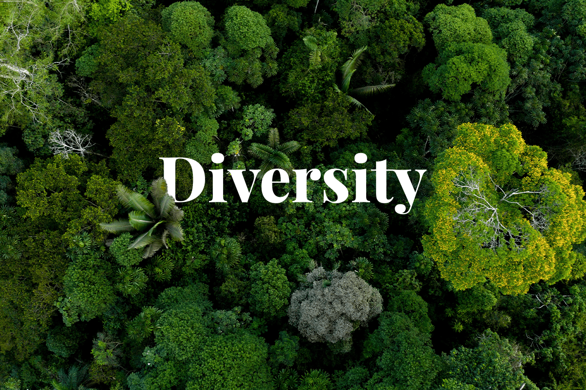
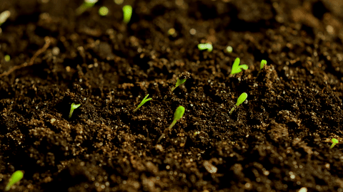

# The Hidden Forest of Talent

> "In nature, nothing exists alone." 
> ― Rachel Carson, Silent Spring

Like a primeval forest where the most vital activity happens beneath the surface, our organizations harbor depths of untapped potential in their people. Through our innovative AI-driven project, we've discovered how to map and nurture this hidden ecosystem of talents, creating a more resilient and vibrant organizational culture. What began as an experiment in using language models to understand our team members has evolved into a profound journey of discovering the rich, interconnected networks of skills and potential that exist within our organization.

## Understanding the Underground Network

==Just as mycorrhizal networks connect trees in a forest==, enabling resource sharing and communication, our AI system reveals the intricate web of soft skills and potential that lies beneath formal job titles and responsibilities. These connections, vital for organizational health, often go unnoticed through traditional assessment methods, hidden beneath the surface of day-to-day operations.

Our approach emerged from a simple observation: the way people communicate, interact, and solve problems reveals far more about their potential than any formal assessment could capture. Through natural language processing, we began analyzing communication patterns across our digital platforms. The AI system gradually revealed patterns of emotional intelligence, leadership potential, and knowledge sharing that had previously been invisible to traditional management perspectives.

## The AI Forest Guide

The role of artificial intelligence in our project became analogous to that of a forest guide – someone who knows where to look, what signs to watch for, and how to interpret the subtle interactions within the ecosystem. Our AI system learned to recognize the natural mentors within teams, identify emerging leadership qualities, and map the informal networks through which knowledge and support flow.

Perhaps most surprisingly, we discovered that the most influential team members weren't always the ones with formal authority. Instead, like the mother trees in a forest that support younger saplings, these individuals often operated quietly, sharing resources and knowledge in ways that traditional organizational charts couldn't capture.

> "The greatest technological breakthroughs of our time have been inspired by the long-perfected systems of nature."
> ― Janine Benyus, Biomimicry

<!-- > Just as a forest's health depends on its diversity, we found that teams with varied cognitive approaches and communication styles showed greater resilience and innovation potential. -->

## Nurturing Growth

==Like a forest that thrives through diversity==, we discovered that organizational growth follows natural patterns that can't be forced but must be understood and supported. The AI helped us identify different types of contributors within our ecosystem: the natural connectors who, like mycorrhizal networks, facilitate knowledge sharing across teams; the growth catalysts who, like nitrogen-fixing plants, enhance the development of those around them; and the stability anchors who, like old-growth trees, provide structural support to the entire organization.

This understanding led us to reshape our approach to talent development. Rather than trying to mold everyone into predetermined roles, we began creating environments where each person's natural tendencies could flourish. The AI system helped us understand the optimal conditions for each type of contributor, much like a forester understanding which species thrive in different parts of the woodland.

## Nature's Mirror: AI-Driven SWOT Analysis

One of the most powerful aspects of our AI system emerged in its ability to reflect back, like a clear forest pool, accurate images of individual and team dynamics through detailed SWOT analyses. Just as a forest ecosystem reveals its health through multiple indicators, our system learned to identify patterns that pointed to distinct strengths, weaknesses, opportunities, and threats within our human ecosystem.

What made this analysis particularly valuable was its validation through user feedback. Each analysis was evaluated by the subjects themselves, who ranked the accuracy of each component and provided an overall assessment of how well the analysis captured their professional essence. The results were remarkable: users consistently reported accuracy ratings above 85% for individual components, with many expressing surprise at insights they hadn't consciously recognized but immediately knew to be true.

==Like a skilled naturalist who can read the signs of forest health==, the system proved particularly adept at identifying latent strengths that hadn't yet found full expression in current roles. It spotted patterns in communication styles, problem-solving approaches, and team interactions that pointed to untapped potential. Similarly, it could identify areas where additional support or development would be most beneficial, much like understanding which parts of a forest need specific nutrients or conditions to thrive.

> "The more clearly we can focus our attention on the wonders and realities of the universe about us, the less taste we shall have for destruction."
> ― Rachel Carson, Silent Spring

This comprehensive understanding has transformed our approach to team composition and mentoring. We now see these elements as part of an interconnected growth system, where each individual's development contributes to the collective flourishing of the whole. Teams can be composed with complementary strengths and growth opportunities, creating resilient units that, like diverse forest patches, are better able to adapt and thrive in changing conditions.

## Measuring Impact

The results of this natural approach to talent development, enhanced by our SWOT analysis capabilities, have been remarkable. We've seen a significant increase in identified leadership potential, not because we're actively searching for leaders, but because we're creating an environment where leadership can emerge naturally. Team collaboration has improved organically as people find their natural roles within the ecosystem. Perhaps most importantly, we've developed a much better understanding of how to support successful role transitions, ~~reducing unexpected departures~~ and enhancing team stability.

## Looking Forward

> "The next great era of human achievement will be born out of the marriage between human intelligence and machine intelligence."
> ― Erik Brynjolfsson, The Second Machine Age

The future of talent development lies in understanding our organizations as living ecosystems rather than mechanical structures. Our project has shown that by combining AI's analytical power with this organic perspective, we can create environments where talent naturally flourishes. The key isn't in controlling growth, but in understanding and nurturing the natural connections and potential that already exist within our teams.

This approach represents a fundamental shift in how we think about organizational development. Instead of trying to shape people to fit predetermined roles, we're learning to see and support the natural patterns of growth and collaboration that emerge when people are given the right conditions to thrive. The AI serves not as a tool of control, but as a lens through which we can better understand and nurture the complex, interconnected network of human potential within our organization.

[^1]: Based on 12-month pilot program results
[^2]: Comparative analysis with traditional assessment methods

> "In every walk with nature one receives far more than he seeks."
> ― John Muir